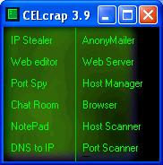



## CELcra\*p 3\.9b

### Description

This is CELcra*p 3.9 beta. I know most of the stuff I have uploaded is a bunch of trash but this is worth looking at. After taking a c++ class i understood OOP a lot more and i think that you will like this version of CELcra*p . . . This is definitely an update and it took a good 6hrs to debug, rebuild, and add on so please vote and check the code out. I know this code is pretty buggy but most of the bugs can be easily understood. I also properly named most of the forms and controls on this program so it should be a little easier to understand. I fixed a memory overflow on the Port Scanner, added features to: IP grabber, HTML editor is visual now, the chat room actually works, is linkable, and you can choose the color scheme for it, the web server is fixed to actually read HTTP requests but no support for large files, the IP masker was appropriatly renamed to 'Host Manager' for the host file, the browser is resizeable and you can choose whether you want to block popups or not, the keylogger was removed for a host scanner and the port scanner doesn't try to load 65355 winsock controls now (lol). Also the program is just about ready for distribution on your websites when you DE-Comment a line of code on the frmMain form on the Form_Load event so that I can actually recieve some credit for it. Also if anyone has ideas for anymore apps to put on this program or bugs to fix then please post. PLEASE D/L AND VOTE!!!

Topics Covered:  Winsock, File I/O, HTTP, SMTP, Popup Blocking . . .
 
### More Info
 

             |
---                |---
**Submitted On**   |2004-02-15 14:43:30
**By**             |[Corey langdon \(has since resigned\)](https://github.com/Planet-Source-Code/PSCIndex/blob/master/ByAuthor/corey-langdon-has-since-resigned.md)
**Level**          |Intermediate
**User Rating**    |4.0 (12 globes from 3 users)
**Compatibility**  |VB 6\.0
**Category**       |[Miscellaneous](https://github.com/Planet-Source-Code/PSCIndex/blob/master/ByCategory/miscellaneous__1-1.md)
**World**          |[Visual Basic](https://github.com/Planet-Source-Code/PSCIndex/blob/master/ByWorld/visual-basic.md)
**Archive File**   |[CELcra\_p\_31709232152004\.zip](https://github.com/Planet-Source-Code/corey-langdon-has-since-resigned-celcra-p-3-9b__1-51779/archive/master.zip)

